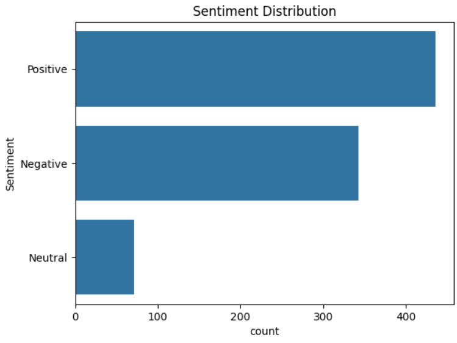
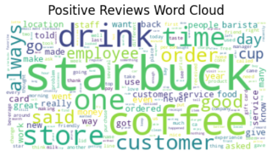
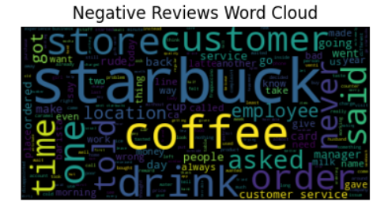

# Customer Sentiment and Insights through Starbucks Review Analysis

## Project Overview

This project aims to leverage natural language processing (NLP) techniques to analyze Starbucks reviews, providing valuable insights into customer sentiment and preferences. 
By understanding customer feedback, Starbucks can make informed decisions to enhance customer satisfaction, drive loyalty, and improve overall business performance.

## Data Description

- **Name:** The reviewer's name, if available.
- **Location:** The location or city associated with the reviewer, if provided.
- **Date:** The date when the review was posted.
- **Rating:** The star rating given by the reviewer, ranging from 1 to 5.
- **Review:** The textual content of the review, capturing the reviewer's experience and opinions.
- **Image Links:** Links to images associated with the reviews, if available.

The dataset comprises a comprehensive collection of consumer reviews and ratings for Starbucks, acquired through web scraping from the Consumer Affairs website.

## Objective

The objective of this project is to analyze Starbucks reviews using NLP techniques to:
1. Extract customer sentiment.
2. Identify consumer preferences.
3. Derive actionable insights for Starbucks locations.

## Key Components

### 1. Data Exploration

- Loaded the dataset and examined its structure.
- Generated summary statistics.

### 2. Preprocessing

- Cleansed and preprocessed the textual reviews by:
  - Tokenizing text.
  - Removing punctuation and stopwords.
  - Retaining essential information for analysis.

### 3. Sentiment Analysis

- Performed sentiment analysis on the reviews.
- Categorized them as positive, negative, or neutral based on the sentiment conveyed by the text.

### 4. Consumer Insights

- Extracted insights regarding customer preferences, common complaints, areas for improvement, and notable positive experiences.
- Explored correlations between ratings, sentiments, and reviewer demographics (e.g., location).

### 5. Topic Modeling

- Employed Latent Dirichlet Allocation (LDA) to identify prevalent topics within the reviews.

### 6. Visualization and Reporting

- Created informative visualizations, such as word clouds, sentiment distribution plots, and topic clusters.
- Generated comprehensive reports summarizing the analysis and actionable insights for Starbucks management.

## Results

### Sentiment Analysis Results

- **Positive reviews:** 436
- **Neutral reviews:** 71
- **Negative reviews:** 343

### Common Themes in Reviews

**Positive themes:**
- ('starbucks', 568)
- ('coffee', 368)
- ('drink', 153)
- ('one', 153)
- ('customer', 145)
- ('get', 142)
- ('time', 138)
- ('store', 134)
- ('service', 124)
- ('would', 124)

**Negative themes:**
- ('starbucks', 446)
- ('coffee', 216)
- ('customer', 132)
- ('get', 127)
- ('service', 126)
- ('drink', 122)
- ('store', 120)
- ('one', 116)
- ('said', 109)
- ('order', 105)

### Topic Modeling

Identified topics:
1. employees, people, asked, customer, drink, order, like, said, coffee, starbucks
2. friendly, good, customer, people, great, drinks, service, starbucks, like, coffee
3. gift, time, money, told, store, service, customer, coffee, card, starbucks
4. rewards, service, new, drink, free, customer, time, coffee, stars, starbucks
5. said, went, customer, order, manager, time, store, drink, coffee, starbucks

### Actionable Insights

**Key areas for improvement:**
- Improve customer service and interaction.
- Address issues related to order accuracy and management.

**Opportunities to enhance customer satisfaction:**
- Focus on maintaining and improving the quality of drinks.
- Enhance the reward programs and customer experience initiatives.

## Visualizations

- **Sentiment Distribution Plot:**
  
- **Word Clouds for Positive and Negative Reviews:**
   

## Deliverables

- Preprocessed dataset.
- Sentiment analysis results.
- Consumer insights and actionable recommendations report.
- Visualizations summarizing review sentiments and topics.

## Conclusion

This project provides valuable insights into customer sentiment and preferences for Starbucks. 
By understanding and acting on this feedback, Starbucks can make informed decisions to enhance customer satisfaction and improve overall business performance.

## How to Run the Project

1. Clone the repository.
2. Install the necessary libraries:
   ```bash
   pip install pandas matplotlib seaborn nltk textblob scikit-learn wordcloud
   ```
3. Run the provided Jupyter Notebook to reproduce the analysis and visualizations.
4. Review the generated reports and visualizations for actionable insights.
